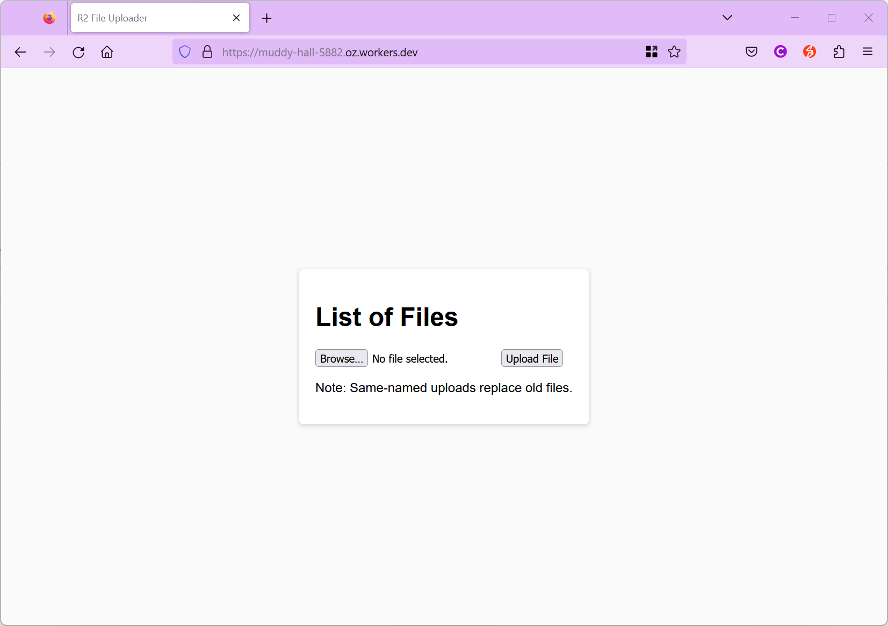
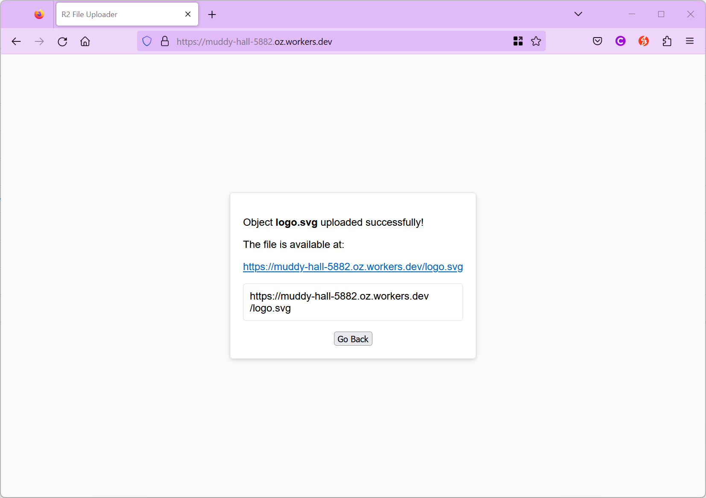
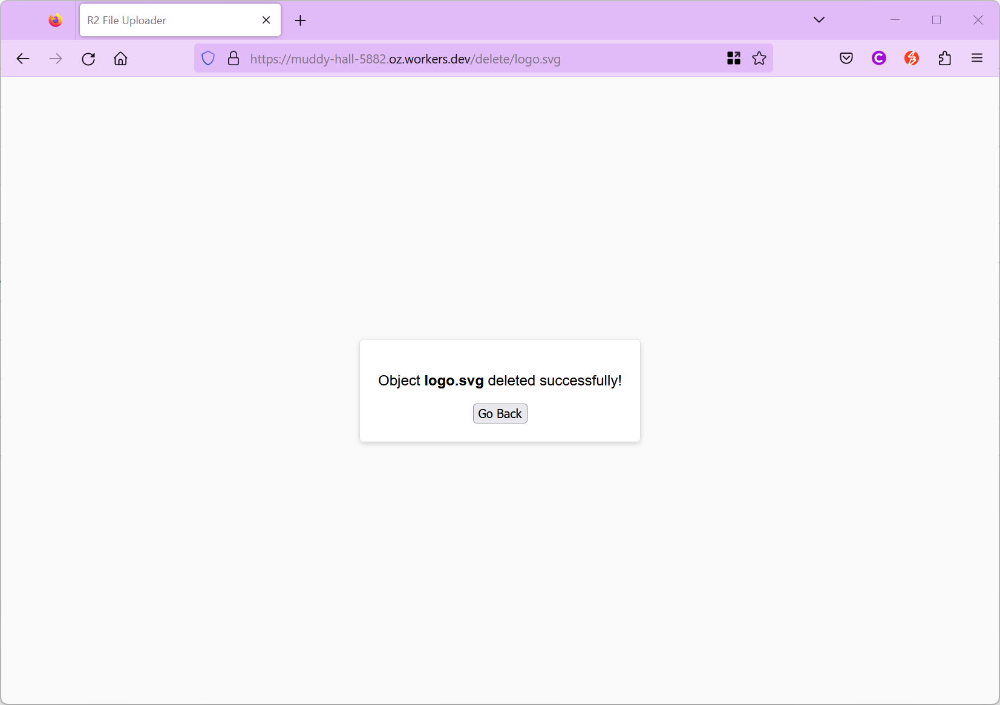

# R2 File Manager

The R2 File Manager is for use on Cloudflare Workers. It provides an intuitive interface for managing files on Cloudflare R2 Storage. It can be protected by employing Cloudflare Access.

## Functionality

The system includes the following features:

- **File Upload**: Users can upload files to the server. This is done via a `PUT` request to the server. The file data is stored in the R2 bucket under the given key.
- **File Listing**: Users can view a list of uploaded files. This is achieved by maintaining a `file-list.txt` in the bucket that contains the names of all uploaded files. The list is updated whenever a file is uploaded or deleted.
- **File Download**: Users can download any uploaded file. This is done via a `GET` request with the file's key. The file data is fetched from the R2 bucket.
- **File Deletion**: Users can delete any uploaded file. This is done via a `GET` request to the `/delete/{filename}` path. The file is removed from the R2 bucket and the file name is removed from `file-list.txt`.

## Usage

The system is designed to be run by Cloudflare Workers.

The worker handles the following HTTP methods:

- `GET`: Fetches the file list or a specific file, or handles file deletion.
- `PUT`: Uploads a file to the server.
- `POST`: Receives file data from a form and saves the file.

## Screenshot

  

## Deployment

Install the required packages and follow the [Cloudflare tutorials](https://developers.cloudflare.com/workers/tutorials/configure-your-cdn/).

1. `npm create cloudflare@latest`
2. `cd` to the new application directory
3. `wrangler r2 bucket create <YOUR_BUCKET_NAME>`
4. `mv wrangler.toml wrangler.toml.bak && echo -e "name = 'YOUR_APPLICATION_NAME'\nmain = 'src/worker.ts'\ncompatibility_date = 'yyyy-mm-dd'\n\n[[r2_buckets]]\nbinding = 'MY_BUCKET'\nbucket_name = '<YOUR_BUCKET_NAME>'" > wrangler.toml`
5. `mv src/worker.ts src/worker.ts.bak`
6. `wget -P src https://raw.githubusercontent.com/msaifuddin/r2-file-manager/main/worker.ts`
7. `npx wrangler deploy`

## Caution

Please keep an eye on your R2 charges ([Cloudflare R2 Pricing](https://developers.cloudflare.com/r2/pricing/)). The functions implemented in this system will generate a number of Class A & B requests. If you want to keep your usage within the free tier, make sure to monitor your usage.

## Security

There is no authentication implemented in this system, as I'm using Cloudflare Access as the access control method. You should add your custom domain and/or the worker domain `<worker>.<name>.workers.dev` to be protected by Access (Self-hosted).

## License

This project is licensed under the MIT license.
